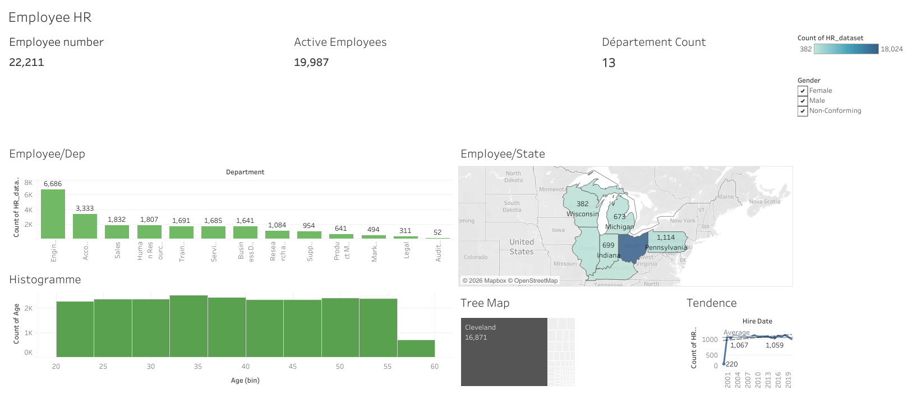

# HR_dataset_BI

# 📊 Projet BI – Visualisation des données

## 📝 Description
Ce projet a été réalisé dans le cadre de mon apprentissage en **Business Intelligence**.  
Il consiste à analyser et visualiser des données à l’aide de **Tableau Public** (Power BI pour la logique BI).

L’objectif principal est de transformer des données brutes en **tableaux de bord clairs et interactifs**, afin de faciliter la compréhension et la prise de décision.

## 🎯 Objectifs du projet
- Comprendre les données et leur structure
- Nettoyer et préparer les données
- Créer des visualisations simples et efficaces
- Présenter les résultats de manière claire

## 🛠️ Outils utilisés
- **Tableau Public** : création des dashboards
- **Power BI (concepts)** : modélisation et analyse des données
- **Fichier de données (CSV / Excel)**

## 📈 Résultats
- Tableaux de bord interactifs
- Indicateurs clés (KPI)
- Visualisation des tendances et comparaisons

## 📊 Dashboard interactif

👉 [Voir le dashboard sur Tableau Public](https://public.tableau.com/views/HR_dataset_17675998198440/Dashboard1?%3Adisplay_static_image=y&%3Aembed=true&%3Aembed=y&%3Alanguage=en-US&%3AshowVizHome=n&%3AapiID=host0#navType=1&navSrc=Parse&2
)

## 🚀 Conclusion
Ce projet m’a permis de renforcer mes compétences en **analyse de données**, **visualisation** et **Business Intelligence**, et de mieux comprendre comment les données peuvent aider à la prise de décision.

